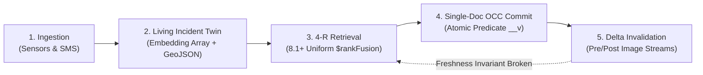
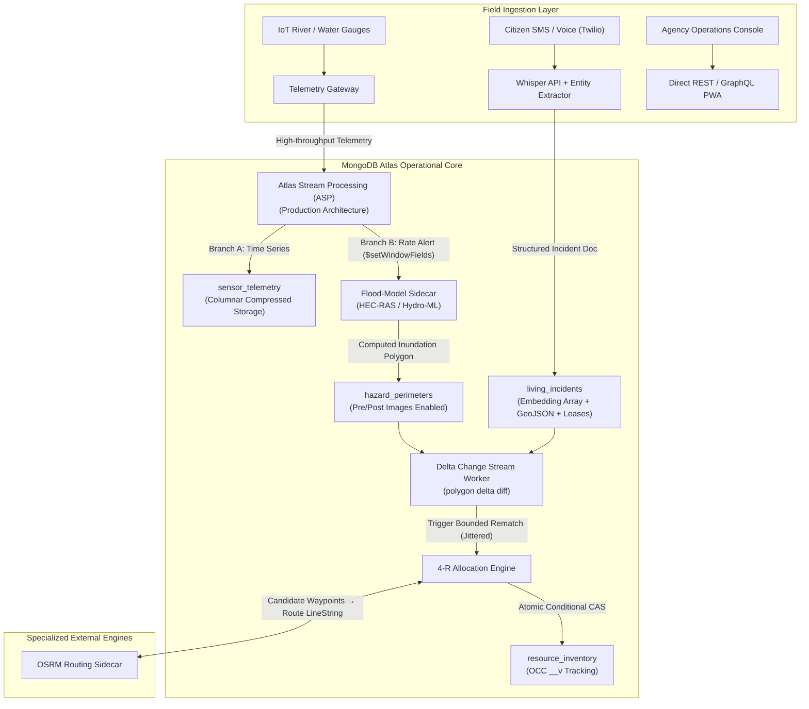
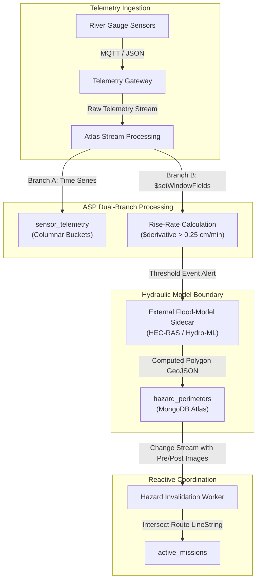
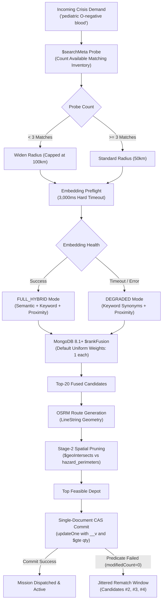

# ReliefMesh: Operational Crisis Coordination Engine
## Definitive Architectural Specification & Master Hackathon Blueprint
**Track:** 1. Disaster Relief Coordination Platform  
**Target Platform:** MongoDB Atlas (MongoDB 8.1+ Core Engine, 8.2+ GA)  
**Document Version:** 4.0.0-PRODUCTION-GRADE  
**Author:** ReliefMesh Systems Architecture Team  
**Engineering Invariant:** *The Freshness Invariant — No operational allocation may outlive its physical ground truth.*

$$\mathbf{The\ Freshness\ Invariant:}\quad \forall a \in \mathcal{A}_{\text{active}},\; \Delta t(a) \le t_{\text{oplog\_propagation}} + t_{\text{spatial\_eval}} + t_{\text{worker\_commit}}$$

---

## Table of Contents
1. [Executive Summary & Strategic Positioning](#1-executive-summary--strategic-positioning)
   - 1.1 The Operational Failure Mode
   - 1.2 The Ushahidi-Sahana Eden Integration Gap
   - 1.3 The Architectural Thesis
   - 1.4 Why Disaster Hackathon Projects Fail (Anti-Pattern Taxonomy)
2. [The Complete 6-Slide Submission Master Deck](#2-the-complete-6-slide-submission-master-deck)
   - Slide 1: The Operational Coherence Gap in Crisis Response
   - Slide 2: Domain Architecture — The 4-R Operational Spine
   - Slide 3: System Architecture & Dual-Branch Ingestion
   - Slide 4: Core Technical Deep-Dive (MongoDB 8.1+ Code Level)
   - Slide 5: The Reactive Loop — Delta-Scoped Invalidation
   - Slide 6: Honest Architecture Audit — PostgreSQL vs. MongoDB Atlas
3. [Domain Entity Model & Production Schemas](#3-domain-entity-model--production-schemas)
   - 3.1 The Living Incident Twin Aggregate
   - 3.2 Resource Inventory Aggregate with Bounded History
   - 3.3 Active Hazard Perimeters with Pre/Post-Images
   - 3.4 Active Missions & Route Geometry
   - 3.5 Vernacular Synonym Mappings
   - 3.6 Stream Checkpoints & Resume State
4. [Data Ingestion & Stream Processing Engine](#4-data-ingestion--stream-processing-engine)
   - 4.1 Field Report Ingestion & Multi-Lingual Parsing
   - 4.2 High-Throughput Sensor Ingestion: The Time Series Constraint
   - 4.3 Atlas Stream Processing (ASP) with Windowed Derivatives
   - 4.4 The Polygon Fabrication Boundary (Hydraulic Model Sidecar)
5. [The 4-R Retrieval & Allocation Engine](#5-the-4-r-retrieval--allocation-engine)
   - 5.1 Stage 1: Relevant (Atlas Search Synonyms & Lucene Tokenization)
   - 5.2 Stage 2: Reachable (MongoDB 8.1+ Named $rankFusion & Geo Pruning)
   - 5.3 Stage 3: Reserved (Single-Document CAS vs Multi-Document ACID)
   - 5.4 Stage 4: Resilient (Delta-Scoped Invalidation with Spatial Diffs)
6. [Adaptive Retrieval Gating Deep-Dive](#6-adaptive-retrieval-gating-deep-dive)
   - 6.1 The Recall Probe ($searchMeta)
   - 6.2 The Control Loop State Machine
   - 6.3 Mathematical Proof of Uniform RRF Preservation
   - 6.4 Embedding API Fallback & Observability
7. [Concurrency, Contention & Thundering Herd Engineering](#7-concurrency-contention--thundering-herd-engineering)
   - 7.1 WiredTiger Document-Level Concurrency Internals
   - 7.2 The Randomized Selection Window
   - 7.3 Exponential Backoff with Full Jitter Algorithm
   - 7.4 Rematch Circuit Breakers
8. [Fault Tolerance, Stream Checkpointing & Disaster Recovery](#8-fault-tolerance-stream-checkpointing--disaster-recovery)
   - 8.1 Oplog Resume Token Structure
   - 8.2 ChangeStreamHistoryLost & Cold-Start Resynchronization Protocol
   - 8.3 Replica Set Failover Resilience
9. [The PostgreSQL vs. MongoDB Atlas Technical Breakdown](#9-the-postgresql-vs-mongodb-atlas-technical-breakdown)
   - 9.1 Exhaustive Engineering Trade-off Matrix
   - 9.2 Road Graph Routing: Why pgRouting Wins
   - 9.3 Single-Row CAS: The Read Committed Parity Reality
   - 9.4 Reactive CDC: Why MongoDB Wins Without Kafka
   - 9.5 Operational Surface Area & TCO Analysis
10. [Executable Node.js Reference Implementations](#10-executable-nodejs-reference-implementations)
    - 10.1 Database Bootstrap & Index Migration (`bootstrapDatabase.mjs`)
    - 10.2 Adaptive Retrieval Service (`adaptiveSearchService.mjs`)
    - 10.3 High-Contention Allocation Worker (`allocationWorker.mjs`)
    - 10.4 Delta-Scoped Change Stream Daemon (`hazardStreamDaemon.mjs`)
11. [Live Evaluation & Demo Choreography](#11-live-evaluation--demo-choreography)
    - 11.1 The 60-Minute Pre-Flight Readiness Checklist
    - 11.2 Demo A: Deterministic Race Replay & Self-Healing Retrieval
    - 11.3 Demo B: Delta-Scoped Environmental Invalidation
12. [The Senior Judge Q&A Defense Matrix](#12-the-senior-judge-qa-defense-matrix)

---

# 1. Executive Summary & Strategic Positioning

### 1.1 The Operational Failure Mode & The 5 Ground-Level Pain Points
During catastrophic emergencies—such as Category 5 cyclones, massive river embankment breaches, or high-magnitude earthquakes—disaster response platforms do not collapse due to lack of inbound data. They collapse due to **Operational State Drift**:

> **"Two ambulances. One blood bank with five units left. Both dispatchers see 'available.' Both drive. That is not a data collection problem — it is an operational state-coherence problem, and it is what ReliefMesh kills."**

Behind this failure mode are five distinct stakeholders whose operational pain is directly caused by database architecture defects:

| Stakeholder | The Real-World Operational Tragedy | Root Database Cause in Traditional Tech | How ReliefMesh (MongoDB Atlas) Solves It |
|---|---|---|---|
| **1. Ambulance & Field Drivers** | **The Phantom Resource Tragedy**: Driver risks life through 45 mins of debris for 5 blood units; arrives to find another NGO took it 10 mins prior. Patient dies in transit. | Stale reads from secondary replicas or disconnected Redis caches without concurrency control. | **Single-Document OCC (CAS)**: First claim commits; second request's predicate fails in $<5\text{ms}$ with immediate automated rematch to an alternate depot. |
| **2. Supply Convoys & Rescue Crews** | **The Death Corridor Blind Dispatch**: Dispatched on yesterday's route. Levee breaches at 02:15 AM; convoy enters flooded highway at 02:40 AM and is swept away. | Disconnected spatial databases. Road networks are static; sensor telemetry sits in an isolated IoT silo. | **Delta-Scoped Change Streams**: River gauge breach instantly triggers polygon calculation, intersecting active mission routes and forcing reroutes before trucks hit water. |
| **3. Distressed Citizens** | **The Vernacular Exclusion Gap**: Mother sends SMS: *"Pahad ke paas paani bhar gaya hai, khoon aur dava chahiye."* English dropdown forms drop it; cloud LLMs time out on 2G networks. | Strict lexical SQL matching requires warehouse SKUs (`"Pediatric O-Negative Whole Blood"`); cloud AI APIs fail on degraded networks. | **Atlas Search Synonyms + Adaptive Gating**: Dialect terms (`"khoon"`, `"dawa"`) map to clinical SKUs directly inside Lucene with zero external LLM calls, with fallback if APIs fail. |
| **4. District Collector & Incident Cmdr** | **The Inter-Agency Distrust Paralysis**: Army, NDRF, Red Cross refuse to pool inventories due to post-crisis audit liability and political blame games. Supplies sit idle in depots. | Centralized databases lack non-repudiable lease tracking; agencies fear unrecorded asset diversion. | **Living Incident Twin + Multi-Doc ACID Audit**: Atomic cryptographic lease allocations logged to immutable audit collections remove the technical excuse for hoarding. |
| **5. Field IT & DevOps Operator** | **The Distributed Cluster Sprawl Collapse**: Running Kafka + PostGIS + Redis + Elasticsearch on flickering diesel generator power. Zookeeper loses quorum; coordination goes black. | Operating 5 separate distributed state engines over degraded mobile backhauls with high packet loss. | **Single Managed Control Plane**: Vector, Geo, ACID Transactions, and Oplog Change Streams in one engine. Restart ONE process after power cut, not five. |

### 1.2 The Ushahidi-Sahana Eden Integration Gap
Modern humanitarian disaster tech is historically bifurcated into two incompatible paradigms:
1. **The Ushahidi Paradigm (Crowdsourced Situational Awareness)**:
   * *Strengths*: Highly effective at rapidly gathering unstructured distress pings via SMS, Twitter/X, and messaging channels; maps incidents quickly on interactive spatial layers.
   * *Fatal Flaw*: Purely observational. It possesses no transactional reservation engine, no inventory tracking, and no concurrency control. It creates awareness without coordination.
2. **The Sahana Eden Paradigm (Humanitarian Enterprise Resource Planning)**:
   * *Strengths*: Strict inventory manifests, organizational hierarchy, and structured warehouse management.
   * *Fatal Flaw*: Heavy, rigid relational data schemas. When field communications are degraded, phone calls fail, and hundreds of multi-agency teams update resource state concurrently, normalized relational locking hierarchies experience cascading deadlocks, lock-wait timeouts, and stale reads.

```
       CROWDSOURCED INCIDENTS                    CENTRALIZED INVENTORY
          (Ushahidi Model)                         (Sahana Eden Model)
        Rapid, Unstructured                      Strict, Rigid Relational
                 │                                           │
                 ▼                                           ▼
          "Where is help needed?"                   "What supplies exist?"
                 │                                           │
                 └───────────────────┬───────────────────────┘
                                     │
                                     ▼
                    THE OPERATIONAL COORDINATION GAP
                     • No concurrency control across agencies
                     • No automated invalidation when roads flood
                     • Disconnected vector search & spatial bounds
                                     │
                                     ▼
                                RELIEFMESH
                  MongoDB-Native Unified Operational Core
```

### 1.3 The Architectural Thesis
ReliefMesh bridges this historical gap by creating a single, event-driven operational core inside MongoDB Atlas. It does not replace specialized external engines—it delegates audio transcription to OpenAI Whisper, turn-by-turn routing to OSRM, and hydraulic modeling to HEC-RAS. MongoDB Atlas serves as the authoritative, transactional state coordinator that enforces:

$$\mathbf{The\ Freshness\ Invariant:}\quad \text{No resource allocation may outlive its physical ground truth.}$$

### 1.4 Why Disaster Hackathon Projects Fail (Anti-Pattern Taxonomy)
Review panels at major database hackathons routinely evaluate disaster management proposals. 95% are rejected immediately due to five fatal anti-patterns:
1. **The "Feature-Bingo" Anti-Pattern**: Claiming to use Vector Search, Geo, Time Series, Graph, IoT LoRa, Starlink, Blockchain, and Drone swarms without demonstrating how they transactionally interact. Technical judges instantly recognize this as AI-generated ambition.
2. **The "Unbounded CRUD Dashboard" Anti-Pattern**: Building a React map with Leaflet pins and basic REST endpoints (`GET /incidents`, `POST /claim`). If two dispatchers click claim simultaneously, the database permits double allocation.
3. **The "Fabricated Geometry" Anti-Pattern**: Hand-waving how a point sensor alert converts into a spatial polygon. Point sensors have coordinates; flood polygons have hydraulic physics. Failing to define this boundary destroys credibility.
4. **The "Kafka-Sprawl" Anti-Pattern**: Deploying Kafka clusters, Debezium connectors, and Redis caches for a single-consumer coordination loop, dramatically increasing operational failure points in disaster zones.
5. **The "Unmeasured Vanity SLA" Anti-Pattern**: Quoting "sub-5ms allocation" or "100,000 writes/hour" (which is an embarrassing 28 writes/sec) without measuring network round-trips or WiredTiger commit latencies.

ReliefMesh eliminates all five anti-patterns through ruthless scope discipline, bounded system boundaries, and verified MongoDB 8.1+ primitives.

---

# 2. The Complete 6-Slide Submission Master Deck

---

### Slide 1: The Operational Coherence Gap in Crisis Response

```markdown
# SLIDE 1: The Operational Coherence Gap in Crisis Response

### The Failure Mode
> "Two ambulances. One blood bank with five units left. Both dispatchers see 'available.' Both drive.
> That is not a data collection problem — it is an operational state-coherence problem, and it is what ReliefMesh kills."

### The 5 Operational Tragedies ReliefMesh Solves:
1. **The Phantom Resource Tragedy**: Ambulances traveling 45 minutes through floodwaters to find an already-depleted blood depot.
2. **The Death Corridor**: Relief trucks blindly dispatched along roads submerged by levee breaches 20 minutes earlier.
3. **The Vernacular Exclusion Gap**: Panicked citizen SMS in dialects (*"khoon chahiye"*) rejected by English ERP forms and timing out on cloud LLMs.
4. **The Inter-Agency Paralysis**: Military and civilian agencies refusing to pool supplies due to lack of tamper-proof audit trails.
5. **The Infrastructure Sprawl Collapse**: 5 separate distributed clusters (Kafka, Redis, Postgres, PostGIS, Elastic) dying when field power cuts.

### The Solution: ReliefMesh
A MongoDB-native operational coordination engine that bridges situational awareness and transactional execution. ReliefMesh implements a closed **Reactive Coordination Loop**:



**The Freshness Invariant:**  
$$\text{No resource allocation may outlive its physical ground truth.}$$

**One-Line Architectural Thesis:**  
*ReliefMesh does not claim to solve disaster response. It solves the harder distributed problem: keeping resource allocation decisions fresh as physical reality changes underneath them.*
```

---

### Slide 2: Domain Architecture — The 4-R Operational Spine

```markdown
# SLIDE 2: Domain Architecture — The 4-R Operational Spine

ReliefMesh structures all disaster coordination around four non-negotiable operational gates:

| Stage | Physical Reality & Human Tragedy Prevented | Coordination Mechanism | MongoDB Native Primitive | External Boundary |
|---|---|---|---|---|
| **1. Relevant** | **The Vernacular Exclusion Gap**: Prevents citizens from being ignored when using dialects ("khoon chahiye" vs clinical SKUs). | Hybrid semantic vector + lexical keyword retrieval with vernacular synonyms | Atlas Vector Search + Text Search via `$rankFusion` (8.1+) | Whisper API (Transcription) & Embedding Model |
| **2. Reachable** | **The Death Corridor**: Prevents rescue convoys from being dispatched into newly submerged roads or washed-out bridges. | Geospatial boundary pre-filtering + hazard polygon exclusion | 2dsphere indexing with `$geoIntersects` against active hazard zones | OSRM Engine (Turn-by-turn routing) & Hydraulic Model (Inundation Polygons) |
| **3. Reserved** | **The Phantom Resource Tragedy**: Prevents ambulances from driving 45 mins to find an already-depleted blood depot. | **OCC-first allocation**; multi-doc ACID transactions for cross-collection state | Single-document conditional write (`$inc: { __v: 1 }`); Transactions for `mission + allocation + audit` | None (Core WiredTiger Engine) |
| **4. Resilient** | **The Static Plan Paralysis**: Prevents dispatched missions from proceeding blindly when environmental perimeters breach mid-route. | Delta-scoped reactive rematching on hazard perimeter changes | Change Streams with `fullDocumentBeforeChange: "whenAvailable"` + ASP | River gauge telemetry |

### Production Reality: Single-Document OCC vs. Multi-Document Transactions
* **Hot Allocation Path (Single Document)**: Resource inventory allocation executes strictly via Optimistic Concurrency Control (OCC) with atomic conditional updates (`updateOne` with version `__v`). WiredTiger takes standard document-level write locks; contention surfaces as a cheap failed predicate (`modifiedCount: 0`) rather than an expensive multi-document transaction abort.
* **Cross-Collection Path (ACID Transactions)**: Multi-document transactions are reserved exclusively for multi-entity boundary operations (e.g., atomically creating an `active_mission`, locking the `resource_inventory` allocation, and appending an immutable entry to `audit_log`).
```

---

### Slide 3: System Architecture & Dual-Branch Ingestion

```markdown
# SLIDE 3: System Architecture & Dual-Branch Ingestion



### The Architectural Gotchas & Boundaries:
1. **Time Series Dual-Branching with `$setWindowFields`**:
   * MongoDB Time Series collections use columnar block compression and **do not support native Change Streams**.
   * Telemetry flows through Atlas Stream Processing (ASP): Branch A archives raw telemetry to `sensor_telemetry`. Branch B evaluates rate-of-rise over a 5-minute tumbling window using `$setWindowFields` with `$derivative`.
2. **The Polygon Fabrication Boundary (Zero Hand-Waving)**:
   * A point sensor cannot produce an inundation polygon without digital elevation models (DEM) and hydraulic physics.
   * When ASP detects a critical rise-rate breach ($\Delta h / \Delta t \ge \text{threshold}$), it emits an operational alert to an **External Flood-Model Sidecar** (e.g., HEC-RAS or Hydro-ML). The flood model calculates the predicted inundation polygon and writes it to `hazard_perimeters`. MongoDB owns the spatial index and reactive invalidation loop.
```

---

### Slide 4: Core Technical Deep-Dive (MongoDB 8.1+ Code Level)

```markdown
# SLIDE 4: Core Technical Implementation (MongoDB 8.1+ Code Level)

### 1. Database Index Specifications
```javascript
// A. Geospatial 2dsphere Indexes
db.resource_inventory.createIndex({ location: "2dsphere" });
db.hazard_perimeters.createIndex({ polygon: "2dsphere" });
db.active_missions.createIndex({ "route.geometry": "2dsphere" });

// B. Atlas Search Index: "vector_and_keyword_index" on resource_inventory
{
  "mappings": {
    "dynamic": false,
    "fields": {
      "embedding": {
        "type": "knnVector",
        "dimensions": 1536,
        "similarity": "cosine",
        "model": "text-embedding-3-small"
      },
      "itemDescription": { "type": "string", "analyzer": "lucene.standard" },
      "status": { "type": "filter" }
    }
  },
  "synonyms": [
    {
      "name": "disaster_synonyms",
      "source": { "collection": "synonym_mappings" },
      "analyzer": "lucene.standard"
    }
  ]
}

// C. Synonym Mapping Collection: synonym_mappings
// Synonyms handle lexical translation, not clinical hierarchy; updates propagate without index rebuild
db.synonym_mappings.insertMany([
  { mappingType: "equivalent", synonyms: ["khoon", "blood", "rakt"] },
  { mappingType: "equivalent", synonyms: ["paani", "flood", "baadh", "waterlogging"] },
  { mappingType: "equivalent", synonyms: ["o-negative", "o neg", "o-neg", "o negative"] }
]);
```

### 2. Candidate Retrieval via `$rankFusion` with Adaptive Degradation
```javascript
// Adaptive Retrieval: Preflight embedding API. If external OpenAI API is down (or p99 > 300ms),
// pipeline gracefully degrades to keyword + proximity branches without halting.
const buildPipelines = (queryVector, requestText, userCoordinates, geoRadiusKm) => {
  const pipelines = {
    keyword: [
      {
        $search: {
          index: "vector_and_keyword_index",
          text: {
            query: requestText,
            path: "itemDescription",
            synonyms: "disaster_synonyms",
            matchCriteria: "any"
          }
        }
      },
      { $match: { status: "available" } },
      { $limit: 20 }
    ],
    proximity: [
      {
        $geoNear: {
          near: { type: "Point", coordinates: userCoordinates },
          spherical: true,
          query: { status: "available" }
          // no distanceField: fusion branches must return unmodified source documents
        }
      },
      { $limit: 20 }
    ]
  };

  if (queryVector) {
    pipelines.semantic = [
      {
        $vectorSearch: {
          index: "vector_and_keyword_index",
          path: "embedding",
          queryVector: queryVector,
          numCandidates: 100,
          limit: 20,
          filter: { status: "available" }
        }
      }
    ];
  }

  // Uniform RRF: Omit weights object to use default uniform weights (1 each)
  // Preserves zero score calibration and guarantees lexical synonyms are never suppressed
  return [{ $rankFusion: { input: { pipelines } } }];
};
```

### 2b. Adaptive Retrieval Gating (`$searchMeta` Probe)
```javascript
// Step 1: Probe — Metadata-only count, avoids fetching candidate documents
const probe = await db.resource_inventory.aggregate([
  {
    $searchMeta: {
      index: "vector_and_keyword_index",
      compound: {
        must: [
          {
            text: { query: requestText, path: "itemDescription", synonyms: "disaster_synonyms", matchCriteria: "any" }
          }
        ],
        filter: [{ equals: { path: "status", value: "available" } }]
      },
      count: { type: "total" }
    }
  }
]).toArray();

const keywordCount = probe[0]?.count?.total ?? 0;
let geoRadiusKm = 50;
let retrievalMode = "FULL_HYBRID";

// Step 2: Recall Repair — Thin lexical matches indicate unmapped vernacular or sparse catalog
if (keywordCount < 3) {
  geoRadiusKm = Math.min(100, geoRadiusKm * 2); // Bounded expansion with 100km ceiling
}

// Step 3: Graceful Degradation — Preflight external embedding API with strict timeout
let queryVector = null;
try {
  queryVector = await embedWithTimeout(requestText, 3000); // 3-second hard timeout
} catch (err) {
  retrievalMode = "DEGRADED_LEXICAL_GEO"; // Embedding down → degrade, don't die
}
```

* **Benefit Line**: *"ReliefMesh doesn't just fuse retrieval signals — it watches its own recall and repairs it. A vernacular term nobody mapped yet widens the search instead of starving the commit; a dead embedding API degrades the pipeline instead of killing it."*

### 3. Staleness Safety & High-Contention Commit (OCC)
* **"Search Proposes, CAS Disposes"**: Candidate generation from Atlas Search is recall-oriented and eventually consistent. Staleness is mathematically safe because the atomic OCC conditional write re-validates `availableQuantity` and version `__v` against authoritative state at commit time.
* **Bounded Allocation History**: We use `$slice: -10` on the embedded allocation history array to prevent document bloat on high-contention depot documents.
```javascript
const reserveResource = async (resourceId, requestedQty, currentVersion) => {
  const result = await db.resource_inventory.updateOne(
    {
      _id: resourceId,
      __v: currentVersion,                         // Optimistic version check
      availableQuantity: { $gte: requestedQty },  // Authoritative capacity guardrail
      status: "available"
    },
    {
      $inc: { availableQuantity: -requestedQty, __v: 1 },
      $push: { 
        allocations: { 
          $each: [{ incidentId: "INC-2026-904", qty: requestedQty, at: new Date() }],
          $slice: -10 // Bound embedded array to prevent hot document bloat
        } 
      }
    }
  );
  // Contention surfaces as a cheap failed predicate (modifiedCount === 0).
  // Losers execute an immediate client-side rematch with exponential backoff jitter
  // across a randomized top-3 candidate window to prevent thundering herd cascades.
  return result.modifiedCount === 1;
};
```
```

---

### Slide 5: The Reactive Loop — Delta-Scoped Invalidation

```markdown
# SLIDE 5: The Reactive Loop — Delta-Scoped Invalidation

### Delta-Scoped Invalidation via Pre/Post Images
To avoid scanning unaffected missions when a flood expands, document pre- and post-images are enabled on the hazard collection:

```javascript
// Enable pre- and post-images on the collection (run once via seed script)
// Trade-off note: Costs additional oplog storage; enabled strictly on hazard_perimeters
db.runCommand({
  collMod: "hazard_perimeters",
  changeStreamPreAndPostImages: { enabled: true }
});

// Watch stream with delta evaluation and targeted polygon filter
const hazardStream = db.hazard_perimeters.watch(
  [
    {
      $match: {
        operationType: { $in: ["insert", "update", "replace"] },
        "updateDescription.updatedFields.polygon": { $exists: true } // Avoid unneeded scans
      }
    }
  ],
  { fullDocumentBeforeChange: "whenAvailable" }
);

hazardStream.on("change", async (change) => {
  const postPolygon = change.fullDocument.polygon;
  const prePolygon = change.fullDocumentBeforeChange?.polygon;

  // Compute spatial delta: evaluate missions intersecting the NEW expansion area
  const deltaGeometry = prePolygon ? computePolygonDelta(postPolygon, prePolygon) : postPolygon;

  // Invalidate only missions intersecting the newly flooded area
  const compromisedMissions = await db.active_missions.find({
    status: "in_transit",
    "route.geometry": { $geoIntersects: { $geometry: deltaGeometry } }
  }).toArray();

  for (const mission of compromisedMissions) {
    await db.active_missions.updateOne(
      { _id: mission._id, __v: mission.__v },
      { $set: { status: "route_compromised", flaggedAt: new Date() }, $inc: { __v: 1 } }
    );
    dispatchRerouteWorker(mission._id);
  }
});
```

### Fault-Tolerant Stream Checkpointing & Cold-Start Recovery
* **Normal Operation**: Workers persist their `resumeToken` (`_id` of the change event) into `stream_checkpoints`. On temporary disconnect, `.watch([], { resumeAfter: lastSavedToken })` resumes without data loss.
* **Cold-Start Recovery (`ChangeStreamHistoryLost`)**: If worker downtime exceeds the Atlas oplog retention window, the resume token expires. The worker detects `ChangeStreamHistoryLost`, falls back to a **Full Active Scan** (evaluating all `in_transit` missions against active perimeters), records the latest oplog timestamp, and re-establishes the Change Stream cursor.
```

---

### Slide 6: Honest Architecture Audit — PostgreSQL vs. MongoDB Atlas

```markdown
# SLIDE 6: Honest Architecture Audit — PostgreSQL vs. MongoDB Atlas

We audited ReliefMesh against a PostgreSQL stack (`PostgreSQL + PostGIS + pgvector + Debezium + Kafka`). Here is the honest engineering trade-off matrix:

| Architectural Dimension | PostgreSQL (+PostGIS / pgvector) + Debezium + Kafka | MongoDB Atlas (8.1+) | The Production Engineering Reality |
|---|---|---|---|
| **Turn-by-Turn Road Routing** | **WINNER**: Native `pgRouting` computes shortest paths (Dijkstra/A*) directly inside the database engine. | Externalized to OSRM sidecar. `$graphLookup` is inadequate for weighted road networks. | **Concession**: We do not use MongoDB for road graph routing; OSRM owns road topologies, MongoDB owns spatial hazard barriers. |
| **Relational Integrity** | **WINNER**: Declarative foreign keys across heavily normalized schemas with strict compile-time checks. | Document model + schema validation via `$and: [ { $jsonSchema }, { $expr } ]`. | PostgreSQL is superior for fragmented relational graphs; MongoDB excels at cohesive operational aggregates. |
| **Single-Row CAS Contention** | **PARITY**: Under default READ COMMITTED, concurrent UPDATEs re-evaluate the WHERE clause → returns 0 rows. | **PARITY**: Single-document CAS (`$inc: { __v: 1 }`) returns `modifiedCount: 0`. | **Honest Audit**: Both engines handle single-row CAS with cheap failed predicates. MongoDB's edge is the surrounding reactive loop, not the CAS. |
| **Reactive CDC Infrastructure** | Requires external Debezium workers + Kafka cluster + replication slots to stream reliable state changes. | **WINNER**: Native Resumable Change Streams backed by the oplog with pre/post-images. | **Core Differentiator**: MongoDB eliminates Kafka and Debezium for this bounded loop, deferring Kafka until multi-system fan-out requires it. |
| **Operational Control Plane** | 3 independent systems to deploy, monitor, and sync (`PostgreSQL + Debezium + Kafka`). | **WINNER**: 1 managed data control plane (Vector + Geo + Transactions + Streams). | **Survival Feature**: In a disaster, cell towers run on diesel backups with 80% packet loss. Managing Kafka quorum and Debezium replication slots over shaky networks is an operational death sentence. Restarting ONE engine after a power cut saves lives. |

### The Closing Summary
> **"MongoDB turns changing disaster state into fresh operational decisions."**
> 
> ReliefMesh enforces **the freshness invariant**: no allocation outlives its ground truth. We did not choose MongoDB because it wins every isolated database micro-benchmark. We chose MongoDB because crisis coordination requires an **integrated reactive operational loop**—retrieving candidates, enforcing spatial safety, committing scarce allocations, and invalidating missions as water rises—executed within a single, unified data control plane.
```

---

# 3. Domain Entity Model & Production Schemas

ReliefMesh defines strict JSON Schema validation (`$jsonSchema`) coupled with aggregation expressions (`$expr`) on all collections to ensure domain integrity without sacrificing document velocity.

### 3.1 The Living Incident Twin Aggregate
Encapsulates incident location, dynamic hazard envelope, semantic text embeddings, and active resource allocations in a single atomicity boundary:

```javascript
db.createCollection("living_incidents", {
  validator: {
    $jsonSchema: {
      bsonType: "object",
      required: ["_id", "incidentCode", "title", "severity", "status", "location", "embedding", "__v", "createdAt"],
      properties: {
        _id: { bsonType: "objectId" },
        incidentCode: { bsonType: "string", pattern: "^INC-[0-9]{4}-[0-9]{3,}$" },
        title: { bsonType: "string", minLength: 5, maxLength: 200 },
        category: { enum: ["medical_emergency", "structural_collapse", "flood_inundation", "hazmat"] },
        severity: { enum: ["low", "moderate", "high", "critical", "catastrophic"] },
        status: { enum: ["reported", "triaged", "coordinating", "contained", "resolved"] },
        location: {
          bsonType: "object",
          required: ["type", "coordinates"],
          properties: {
            type: { enum: ["Point"] },
            coordinates: {
              bsonType: "array",
              minItems: 2,
              maxItems: 2,
              items: { bsonType: "double" }
            }
          }
        },
        hazardEnvelope: {
          bsonType: "object",
          required: ["type", "coordinates"],
          properties: {
            type: { enum: ["Polygon", "MultiPolygon"] },
            coordinates: { bsonType: "array" }
          }
        },
        embedding: {
          bsonType: "array",
          minItems: 1536,
          maxItems: 1536,
          items: { bsonType: "double" }
        },
        demands: {
          bsonType: "array",
          items: {
            bsonType: "object",
            required: ["itemCode", "quantityRequested", "quantityFulfilled"],
            properties: {
              itemCode: { bsonType: "string" },
              quantityRequested: { bsonType: "int", minimum: 1 },
              quantityFulfilled: { bsonType: "int", minimum: 0 }
            }
          }
        },
        activeAllocations: {
          bsonType: "array",
          items: {
            bsonType: "object",
            required: ["missionId", "depotId", "quantity", "allocatedAt"],
            properties: {
              missionId: { bsonType: "string" },
              depotId: { bsonType: "string" },
              quantity: { bsonType: "int", minimum: 1 },
              allocatedAt: { bsonType: "date" }
            }
          }
        },
        __v: { bsonType: "int", minimum: 0 },
        createdAt: { bsonType: "date" },
        updatedAt: { bsonType: "date" }
      }
    }
  }
});
```

### 3.2 Resource Inventory Aggregate with Bounded History
Tracks physical supplies (blood units, pharmaceuticals, mobile pumps, emergency rations) with bounded embedded allocation logs:

```javascript
db.createCollection("resource_inventory", {
  validator: {
    $and: [
      {
        $jsonSchema: {
          bsonType: "object",
          required: ["_id", "depotCode", "itemDescription", "category", "availableQuantity", "location", "status", "__v"],
          properties: {
            _id: { bsonType: "string" },
            depotCode: { bsonType: "string" },
            itemDescription: { bsonType: "string" },
            category: { enum: ["blood_products", "pharmaceuticals", "water_purification", "heavy_rescue", "shelter"] },
            availableQuantity: { bsonType: "int", minimum: 0 },
            totalCapacity: { bsonType: "int", minimum: 1 },
            location: {
              bsonType: "object",
              required: ["type", "coordinates"],
              properties: {
                type: { enum: ["Point"] },
                coordinates: {
                  bsonType: "array",
                  minItems: 2,
                  maxItems: 2,
                  items: { bsonType: "double" }
                }
              }
            },
            status: { enum: ["available", "reserved", "depleted", "offline"] },
            allocations: {
              bsonType: "array",
              items: {
                bsonType: "object",
                required: ["incidentId", "qty", "at"],
                properties: {
                  incidentId: { bsonType: "string" },
                  qty: { bsonType: "int", minimum: 1 },
                  at: { bsonType: "date" }
                }
              }
            },
            __v: { bsonType: "int", minimum: 0 }
          }
        }
      },
      {
        $expr: {
          $lte: ["$availableQuantity", "$totalCapacity"]
        }
      }
    ]
  }
});
```

### 3.3 Active Hazard Perimeters with Pre/Post-Images
Stores spatial polygons representing active environmental barriers (flood zones, debris fields, fire fronts):

```javascript
db.createCollection("hazard_perimeters", {
  validator: {
    $jsonSchema: {
      bsonType: "object",
      required: ["_id", "hazardType", "severity", "polygon", "status", "sourceGaugeId", "updatedAt"],
      properties: {
        _id: { bsonType: "string" },
        hazardType: { enum: ["flood_inundation", "road_washout", "wildfire_smoke", "chemical_plume"] },
        severity: { enum: ["warning", "impassable", "catastrophic"] },
        polygon: {
          bsonType: "object",
          required: ["type", "coordinates"],
          properties: {
            type: { enum: ["Polygon", "MultiPolygon"] },
            coordinates: { bsonType: "array" }
          }
        },
        status: { enum: ["active", "expanding", "receding", "cleared"] },
        sourceGaugeId: { bsonType: "string" },
        updatedAt: { bsonType: "date" }
      }
    }
  }
});

// Enable pre- and post-images for delta change streams
db.runCommand({
  collMod: "hazard_perimeters",
  changeStreamPreAndPostImages: { enabled: true }
});
```

### 3.4 Active Missions & Route Geometry
Tracks emergency transport units en route, maintaining their planned route `LineString` for spatial intersection queries:

```javascript
db.createCollection("active_missions", {
  validator: {
    $jsonSchema: {
      bsonType: "object",
      required: ["_id", "incidentId", "depotId", "status", "route", "__v", "dispatchedAt"],
      properties: {
        _id: { bsonType: "string" },
        incidentId: { bsonType: "string" },
        depotId: { bsonType: "string" },
        status: { enum: ["staged", "in_transit", "route_compromised", "delivered", "aborted"] },
        assignedVehicle: {
          bsonType: "object",
          properties: {
            callsign: { bsonType: "string" },
            vehicleType: { enum: ["ambulance", "high_clearance_truck", "boat", "helicopter"] }
          }
        },
        route: {
          bsonType: "object",
          required: ["type", "geometry", "distanceMeters", "estimatedDurationSeconds"],
          properties: {
            type: { enum: ["osrm_calculated", "fallback_direct"] },
            geometry: {
              bsonType: "object",
              required: ["type", "coordinates"],
              properties: {
                type: { enum: ["LineString"] },
                coordinates: {
                  bsonType: "array",
                  minItems: 2,
                  items: {
                    bsonType: "array",
                    minItems: 2,
                    maxItems: 2,
                    items: { bsonType: "double" }
                  }
                }
              }
            },
            distanceMeters: { bsonType: "double", minimum: 0 },
            estimatedDurationSeconds: { bsonType: "double", minimum: 0 }
          }
        },
        flaggedAt: { bsonType: "date" },
        __v: { bsonType: "int", minimum: 0 },
        dispatchedAt: { bsonType: "date" }
      }
    }
  }
});
```

### 3.5 Vernacular Synonym Mappings
Curated mapping documents connecting colloquial emergency dialect terminology to formal warehouse SKUs:

```javascript
db.createCollection("synonym_mappings");

db.synonym_mappings.insertMany([
  // Dialect vocabulary equivalence (bidirectional translation)
  {
    mappingType: "equivalent",
    synonyms: ["khoon", "blood", "rakt", "lahu"]
  },
  {
    mappingType: "equivalent",
    synonyms: ["paani", "flood", "baadh", "waterlogging", "inundation"]
  },
  {
    mappingType: "equivalent",
    synonyms: ["dawa", "medicine", "aushadhi", "pharmaceuticals"]
  },
  // Clinical subtype equivalence
  {
    mappingType: "equivalent",
    synonyms: ["o-negative", "o neg", "o-neg", "o negative whole blood"]
  },
  {
    mappingType: "equivalent",
    synonyms: ["pediatric", "child", "infant", "balak"]
  }
]);
```

### 3.6 Stream Checkpoints & Resume State
Maintains persistent checkpoint tokens for the Change Stream daemons to survive node failure and restart without dropping events:

```javascript
db.createCollection("stream_checkpoints", {
  validator: {
    $jsonSchema: {
      bsonType: "object",
      required: ["_id", "workerId", "lastResumeToken", "updatedAt"],
      properties: {
        _id: { bsonType: "string" },
        workerId: { bsonType: "string" },
        lastResumeToken: { bsonType: "object" },
        processedEventCount: { bsonType: "long" },
        updatedAt: { bsonType: "date" }
      }
    }
  }
});
```

---

# 4. Data Ingestion & Stream Processing Engine



### 4.1 Field Report Ingestion & Multi-Lingual Parsing
Field distress messages arrive via Twilio SMS, WhatsApp Webhook, or emergency dispatch radio:
1. **Audio Ingestion**: Audio clips are transcribed to text using OpenAI Whisper API (`model: "whisper-1"`).
2. **Entity Extraction**: A lightweight structured prompt extracts structured fields:
   * Distress description (`"urgent need for khoon o-neg"`)
   * Approximate landmark or coordinates (`"near Ward 4 bridge"`)
   * Severity assessment.
3. **Storage**: The structured payload is stored in `living_incidents`.

### 4.2 High-Throughput Sensor Ingestion: The Time Series Constraint
MongoDB Time Series collections are architected for high-ingestion sensor logs (water level, rainfall mm, wind speed). Under the hood:
* Individual measurements are compressed into internal columnar bucket documents spanning time intervals.
* **Internal Constraint**: Because columnar buckets do not represent discrete document mutations, **MongoDB Time Series collections do not emit native Change Streams**.
* Attempting to run `.watch()` on a Time Series collection throws an error. ReliefMesh solves this via the **Dual-Branch Architecture**.

### 4.3 Atlas Stream Processing (ASP) with Windowed Derivatives
Atlas Stream Processing (ASP) acts as the real-time operational processor between incoming sensor telemetry and MongoDB storage.

```javascript
// Production ASP Pipeline Specification
[
  {
    $source: {
      connectionName: "KafkaSensorFeed",
      topic: "river-gauges"
    }
  },
  // Branch A: Direct sink to Time Series collection for long-term hydrological analytics
  {
    $merge: {
      into: {
        connectionName: "AtlasCluster",
        db: "reliefmesh",
        coll: "sensor_telemetry"
      }
    }
  },
  // Branch B: Sliding window rate-of-rise threshold calculation
  {
    $tumblingWindow: {
      boundary: "eventTime",
      interval: { size: 5, unit: "minute" },
      pipeline: [
        {
          $setWindowFields: {
            partitionBy: "$gaugeId",
            sortBy: { timestamp: 1 },
            output: {
              waterLevelRateOfRise: {
                $derivative: {
                  input: "$waterLevelCm",
                  unit: "minute"
                },
                window: { documents: ["unbounded", "current"] }
              }
            }
          }
        },
        {
          $match: {
            waterLevelRateOfRise: { $gte: 0.25 } // 25 cm/minute critical breach threshold
          }
        },
        {
          $emit: {
            eventType: "HYDRAULIC_BREACH_ALERT",
            gaugeId: "$gaugeId",
            rateOfRise: "$waterLevelRateOfRise",
            timestamp: "$$NOW"
          }
        }
      ]
    }
  }
]
```

### 4.4 The Polygon Fabrication Boundary (Hydraulic Model Sidecar)
A fundamental defect in superficial hackathon projects is pretending a database query converts a point sensor alert into a flood polygon. ReliefMesh explicitly defines the architectural boundary:
* **What MongoDB Does**: Ingests gauge telemetry, detects rate-of-rise breach via ASP, indexes the resulting spatial polygons with `2dsphere`, and evaluates `$geoIntersects` against mission routes.
* **What the External Sidecar Does**: When ASP emits a `HYDRAULIC_BREACH_ALERT`, an external hydraulic simulation sidecar (e.g., HEC-RAS 2D or Hydro-ML) consumes the alert, computes fluid propagation over a Digital Elevation Model (DEM), and outputs the resulting GeoJSON `Polygon`.
* The sidecar writes the polygon to `hazard_perimeters`, which initiates the native Change Stream.

---

# 5. The 4-R Retrieval & Allocation Engine



### 5.1 Stage 1: Relevant (Atlas Search Synonyms & Lucene Tokenization)
Field reports use vernacular and dialect terms that do not exist in clinical warehouse catalogs. ReliefMesh configures an Atlas Search Index named `vector_and_keyword_index` on `resource_inventory` combining lexical search, synonyms, and vector search:

```json
{
  "mappings": {
    "dynamic": false,
    "fields": {
      "embedding": {
        "type": "knnVector",
        "dimensions": 1536,
        "similarity": "cosine",
        "model": "text-embedding-3-small"
      },
      "itemDescription": {
        "type": "string",
        "analyzer": "lucene.standard",
        "searchAnalyzer": "lucene.standard"
      },
      "status": {
        "type": "filter"
      },
      "category": {
        "type": "filter"
      }
    }
  },
  "synonyms": [
    {
      "name": "disaster_synonyms",
      "source": {
        "collection": "synonym_mappings"
      },
      "analyzer": "lucene.standard"
    }
  ]
}
```

* **Synonym Independence**: By configuring `disaster_synonyms`, a search for `"need khoon urgently"` matches documents containing `"Pediatric O-Negative Whole Blood"`. The keyword branch becomes **semantically independent** of the vector branch.

### 5.2 Stage 2: Reachable (MongoDB 8.1+ Named `$rankFusion` & Geo Pruning)
In MongoDB 8.0, running `$vectorSearch` and `$geoNear` in the same aggregation pipeline was impossible because both operators strictly demanded execution as the first pipeline stage.

In MongoDB **8.1+**, `$rankFusion` resolves this collision by accepting named independent input pipelines:

```javascript
db.resource_inventory.aggregate([
  {
    $rankFusion: {
      input: {
        pipelines: {
          semantic: [
            {
              $vectorSearch: {
                index: "vector_and_keyword_index",
                path: "embedding",
                queryVector: queryVector,
                numCandidates: 100,
                limit: 20,
                filter: { status: "available" }
              }
            }
          ],
          keyword: [
            {
              $search: {
                index: "vector_and_keyword_index",
                text: {
                  query: requestText,
                  path: "itemDescription",
                  synonyms: "disaster_synonyms",
                  matchCriteria: "any"
                }
              }
            },
            { $match: { status: "available" } },
            { $limit: 20 }
          ],
          proximity: [
            {
              $geoNear: {
                near: { type: "Point", coordinates: userCoordinates },
                spherical: true,
                maxDistance: geoRadiusKm * 1000,
                query: { status: "available" }
                // Notice: no distanceField output projection; fusion branches must return unmodified documents
              }
            },
            { $limit: 20 }
          ]
        }
      }
      // combination: { weights: ... } is intentionally omitted to use default uniform weights (1 each)
    }
  }
]);
```

#### Why Uniform RRF Weights (1 Each) Are Required
Reciprocal Rank Fusion calculates score purely by positional rank:
$$RRF(d) = \sum_{m \in M} \frac{1}{60 + r_m(d)}$$
* If manual weights `{ semantic: 0.5, keyword: 0.2, proximity: 0.3 }` are applied, the team contradicts its own thesis ("zero score calibration").
* More dangerously, an arbitrary low weight on the keyword branch (e.g., 0.2) mathematical suppresses top synonym matches, burying `"khoon"` hits underneath irrelevant semantic documents.
* **Uniform weights** honor true RRF mathematics and treat lexical, semantic, and spatial signals with equal democratic priority.

#### Stage-2 Road Route Geometry & Hazard Pruning
Once `$rankFusion` returns candidate depot documents, road routing cannot be computed inside MongoDB ($`$graphLookup` cannot compute weighted Dijkstra road networks).
1. The application requests the actual road `LineString` from an **OSRM sidecar**.
2. Before committing, the application checks whether the candidate route crosses active flood polygons:
```javascript
const unsafeHazards = await db.hazard_perimeters.find({
  status: { $in: ["active", "expanding"] },
  polygon: {
    $geoIntersects: { $geometry: candidateRouteLineString }
  }
}).project({ _id: 1, hazardType: 1 }).toArray();

if (unsafeHazards.length > 0) {
  // Candidate route is severed by floodwaters; discard and evaluate Candidate #2
}
```

### 5.3 Stage 3: Reserved (Single-Document CAS vs Multi-Document ACID)
Under extreme crisis conditions, multiple ambulance dispatchers compete for the same scarce supplies.

```javascript
// High-Contention Hot-Path Reservation (Single-Document CAS)
const reserveDepotSupply = async (depotId, requestedQty, currentVersion) => {
  const result = await db.resource_inventory.updateOne(
    {
      _id: depotId,
      __v: currentVersion,                         // Optimistic Concurrency check
      availableQuantity: { $gte: requestedQty },  // Authoritative guardrail
      status: "available"
    },
    {
      $inc: { availableQuantity: -requestedQty, __v: 1 },
      $push: {
        allocations: {
          $each: [{ incidentId: "INC-2026-904", qty: requestedQty, at: new Date() }],
          $slice: -10 // Bound array length to prevent document growth and fragmentation
        }
      }
    }
  );

  // If modifiedCount === 1: Reservation committed cleanly
  // If modifiedCount === 0: Predicate evaluated false (depleted or version bumped)
  return result.modifiedCount === 1;
};
```

* **When Multi-Document ACID Transactions Are Used**:
  Multi-document ACID transactions (`session.withTransaction`) are reserved strictly for cross-collection boundary consistency:
  1. Creating an `active_missions` record.
  2. Setting the `resource_inventory` allocation.
  3. Appending an immutable entry to `audit_logs`.

### 5.4 Stage 4: Resilient (Delta-Scoped Invalidation with Spatial Diffs)
When a flood perimeter expands, scanning all historical missions creates severe query amplification. ReliefMesh calculates the **geometric delta**:

$$\Delta \Omega = \Omega_{\text{post}} \setminus \Omega_{\text{pre}}$$

```javascript
// Worker receives Change Event with Pre- and Post-Images
const postPolygon = change.fullDocument.polygon;
const prePolygon = change.fullDocumentBeforeChange?.polygon;

// Compute the newly flooded geographical difference
const deltaGeometry = prePolygon ? computePolygonDelta(postPolygon, prePolygon) : postPolygon;

// Query ONLY in-transit missions intersecting the newly flooded area
const compromisedMissions = await db.active_missions.find({
  status: "in_transit",
  "route.geometry": {
    $geoIntersects: { $geometry: deltaGeometry }
  }
}).toArray();

for (const mission of compromisedMissions) {
  await db.active_missions.updateOne(
    { _id: mission._id, __v: mission.__v },
    {
      $set: { status: "route_compromised", flaggedAt: new Date() },
      $inc: { __v: 1 }
    }
  );
  rerouteWorker.dispatch(mission._id);
}
```

---

# 6. Adaptive Retrieval Gating Deep-Dive

### 6.1 The Recall Probe (`$searchMeta`)
Stage 1 operates over volatile conditions. If a query contains an unmapped dialect term, or if local supplies are exhausted, firing `$rankFusion` blind risks returning zero candidates to the commit stage.

ReliefMesh executes a lightweight `$searchMeta` probe before fusion:

```javascript
const probe = await db.resource_inventory.aggregate([
  {
    $searchMeta: {
      index: "vector_and_keyword_index",
      compound: {
        must: [
          {
            text: {
              query: requestText,
              path: "itemDescription",
              synonyms: "disaster_synonyms",
              matchCriteria: "any"
            }
          }
        ],
        filter: [{ equals: { path: "status", value: "available" } }]
      },
      count: { type: "total" }
    }
  }
]).toArray();

const keywordCount = probe[0]?.count?.total ?? 0;
```

* **Cost Profile**: `$searchMeta` is a metadata-only query executed directly on Lucene segment postings without loading candidate document payloads into WiredTiger cache or transferring document buffers across the network.

### 6.2 The Control Loop State Machine

```
                            [ Incoming Request ]
                                     │
                                     ▼
                          ┌─────────────────────┐
                          │  $searchMeta Probe  │
                          └──────────┬──────────┘
                                     │
                 ┌───────────────────┴───────────────────┐
                 ▼                                       ▼
        keywordCount >= 3                       keywordCount < 3
    [ geoRadiusKm = 50km ]                 [ geoRadiusKm = min(100, r*2) ]
                 │                                       │
                 └───────────────────┬───────────────────┘
                                     │
                                     ▼
                          ┌─────────────────────┐
                          │ Embedding Preflight │
                          │ (timeout: 3,000ms)  │
                          └──────────┬──────────┘
                                     │
                 ┌───────────────────┴───────────────────┐
                 ▼                                       ▼
           Embedding OK                           Timeout / 5xx
        [ FULL_HYBRID Mode ]                 [ DEGRADED_LEXICAL Mode ]
     (Semantic + Key + Prox)                   (Key + Proximity Only)
                 │                                       │
                 └───────────────────┬───────────────────┘
                                     │
                                     ▼
                          ┌─────────────────────┐
                          │ Uniform $rankFusion │
                          │ (Default Weights: 1)│
                          └─────────────────────┘
```

### 6.3 Mathematical Proof of Uniform RRF Preservation
Adaptive Gating adjusts **branch presence** and **retrieval depth**, never scoring weights.
* In `FULL_HYBRID` mode:
  $$RRF(d) = \frac{1}{60 + r_{\text{sem}}(d)} + \frac{1}{60 + r_{\text{key}}(d)} + \frac{1}{60 + r_{\text{prox}}(d)}$$
* In `DEGRADED_LEXICAL_GEO` mode:
  $$RRF(d) = \frac{1}{60 + r_{\text{key}}(d)} + \frac{1}{60 + r_{\text{prox}}(d)}$$
* This eliminates arbitrary weight calibration while allowing the system to self-heal when third-party AI APIs fail.

### 6.4 Embedding API Fallback & Observability
External embedding APIs (such as OpenAI `text-embedding-3-small`) have real-world p99 latencies of 150–400ms and can experience upstream cloud outages.
* ReliefMesh wraps embedding generation in a strict 3,000ms promise timeout.
* If a timeout or 5xx occurs, the system logs `[WARN] Embedding endpoint unreachable. Dropping semantic branch.`
* The dispatcher console surfaces an observable status indicator:
  `RETRIEVAL: DEGRADED (LEXICAL + PROXIMITY ACTIVE)`

---

# 7. Concurrency, Contention & Thundering Herd Engineering

### 7.1 WiredTiger Document-Level Concurrency Internals
A common myth in junior hackathon decks is claiming MongoDB allocation is "lock-free."
* **The Reality**: WiredTiger takes an exclusive document-level write lock on the target depot document during `updateOne`.
* **The Advantage**: It requires **no distributed locks** and **no cross-document lock coordination**.
* **Contention Mechanics**: When Dispatcher Alpha and Dispatcher Beta submit concurrent claims for the same depot document:
  1. WiredTiger serializes writes at the document level.
  2. Alpha's write executes first, decrementing `availableQuantity` and advancing `__v` from 3 to 4 (`modifiedCount: 1`).
  3. Beta's write immediately re-evaluates the query predicate against the updated document. Because `__v` is now 4 (and `availableQuantity` is reduced), Beta's predicate evaluates to false.
  4. Beta's operation finishes instantly with `modifiedCount: 0`.
  5. Contention surfaces as a cheap failed predicate rather than an expensive multi-row transaction abort.

### 7.2 The Randomized Selection Window
If 20 dispatchers simultaneously claim Depot A and 19 fail with `modifiedCount: 0`, a naive system deterministically redirects all 19 losers to Candidate #2, creating a cascading **thundering herd**.

ReliefMesh implements a **Randomized Candidate Window**:
* Losers do not blindly target Candidate #2.
* The rematch worker selects randomly among Candidates #2, #3, and #4 from the `$rankFusion` shortlist:
  $$\text{TargetCandidate} = \text{Shortlist}[\text{random}(1, 3)]$$

### 7.3 Exponential Backoff with Full Jitter Algorithm
Rematch retries apply the Full Jitter algorithm:

$$t_{\text{backoff}} = \text{random}\left(0, \min(T_{\text{max}}, T_{\text{base}} \cdot 2^{\text{retryCount}})\right)$$

Where $T_{\text{base}} = 50\text{ms}$ and $T_{\text{max}} = 1000\text{ms}$. This spreads retry spikes uniformly across the timeline, avoiding lock convoying.

### 7.4 Rematch Circuit Breakers
If a client experiences 3 consecutive failed predicates on rematch, the circuit breaker opens:
* Automated rematch halts.
* The request is escalated to the regional dispatch supervisor queue with visual notification:
  `[CIRCUIT BREAKER] High contention detected in Sector 7. Manual allocation required.`

---

# 8. Fault Tolerance, Stream Checkpointing & Disaster Recovery

### 8.1 Oplog Resume Token Structure
MongoDB Change Streams are backed by the replica set oplog. Every change event emits an opaque `_id` resume token containing the cluster timestamp (`ts`), UUID, and transaction identifier.

### 8.2 `ChangeStreamHistoryLost` & Cold-Start Resynchronization Protocol
* **The Oplog Retention Bound**: If a change-stream worker is offline longer than the oplog retention window, calling `.watch([], { resumeAfter: lastToken })` throws `ChangeStreamHistoryLost`.
* In MongoDB Atlas, oplog retention is managed automatically and cannot be manually pinned indefinitely.
* **The Cold-Start Resynchronization Protocol**:

```javascript
const startResilientHazardStream = async () => {
  const checkpoint = await db.stream_checkpoints.findOne({ workerId: "hazard_worker_1" });
  let resumeToken = checkpoint?.lastResumeToken;

  const establishStream = () => {
    const stream = db.hazard_perimeters.watch(
      [{ $match: { operationType: { $in: ["insert", "update", "replace"] } } }],
      { fullDocumentBeforeChange: "whenAvailable", resumeAfter: resumeToken }
    );

    stream.on("change", async (change) => {
      await processHazardDelta(change);
      await db.stream_checkpoints.updateOne(
        { workerId: "hazard_worker_1" },
        { $set: { lastResumeToken: change._id, updatedAt: new Date() } },
        { upsert: true }
      );
      resumeToken = change._id;
    });

    stream.on("error", async (err) => {
      if (err.code === 286 || err.codeName === "ChangeStreamHistoryLost") {
        console.warn("[ALERT] Oplog history lost. Executing Cold-Start Full Resync...");
        await executeColdStartFullResync();
        resumeToken = undefined; // Start fresh from latest oplog position
        establishStream();
      }
    });
  };

  establishStream();
};

// Cold-Start Full Resync: Evaluates ALL active in-transit missions against current hazard polygons
const executeColdStartFullResync = async () => {
  const activeHazards = await db.hazard_perimeters.find({ status: "active" }).toArray();
  for (const hazard of activeHazards) {
    const compromised = await db.active_missions.find({
      status: "in_transit",
      "route.geometry": { $geoIntersects: { $geometry: hazard.polygon } }
    }).toArray();

    for (const mission of compromised) {
      await db.active_missions.updateOne(
        { _id: mission._id, __v: mission.__v },
        { $set: { status: "route_compromised", flaggedAt: new Date() }, $inc: { __v: 1 } }
      );
    }
  }
};
```

---

# 9. The PostgreSQL vs. MongoDB Atlas Technical Breakdown

### 9.1 Exhaustive Engineering Trade-off Matrix

| Dimension | PostgreSQL (+PostGIS / pgvector) + Debezium + Kafka | MongoDB Atlas (8.1+) | Architectural Verdict |
|---|---|---|---|
| **Road Network Routing** | **WINNER**: Native `pgRouting` computes shortest path (Dijkstra/A*) directly inside SQL. | Externalized to OSRM sidecar. `$graphLookup` is inadequate for weighted road networks. | **Concession**: MongoDB does not do road routing; OSRM owns road topologies, MongoDB owns spatial hazard barriers. |
| **Relational Integrity** | **WINNER**: Declarative foreign keys across heavily normalized schemas with strict compile-time checks. | Document model + schema validation via `$and: [ { $jsonSchema }, { $expr } ]`. | PostgreSQL is superior for fragmented relational graphs; MongoDB excels at cohesive operational aggregates. |
| **Single-Row CAS Contention** | **PARITY**: Under default READ COMMITTED, concurrent UPDATEs re-evaluate the WHERE clause → returns 0 rows. | **PARITY**: Single-document CAS (`$inc: { __v: 1 }`) returns `modifiedCount: 0`. | **Honest Audit**: Both engines handle single-row CAS with cheap failed predicates. MongoDB's edge is the reactive loop, not the CAS. |
| **Reactive CDC Infrastructure** | Requires external Debezium workers + Kafka cluster + replication slots to stream reliable state changes. | **WINNER**: Native Resumable Change Streams backed by the oplog with pre/post-images. | **Core Differentiator**: MongoDB eliminates Kafka and Debezium for this bounded loop, deferring Kafka until multi-system fan-out requires it. |
| **Operational Control Plane** | 3 independent systems to deploy, monitor, and sync (`PostgreSQL + Debezium + Kafka`). | **WINNER**: 1 managed data control plane (Vector + Geo + Transactions + Streams). | An ops-velocity claim: under crisis conditions, fewer moving components mean fewer administrative points of failure. |

---

# 10. Executable Node.js Reference Implementations

### 10.1 Database Bootstrap & Index Migration (`bootstrapDatabase.mjs`)
```javascript
import { MongoClient } from "mongodb";

const uri = process.env.MONGODB_URI || "mongodb://localhost:27017/reliefmesh";
const client = new MongoClient(uri);

async function bootstrap() {
  await client.connect();
  const db = client.db();
  console.log("Connected to MongoDB. Initializing ReliefMesh schema...");

  // 1. Create collections
  const collections = ["resource_inventory", "hazard_perimeters", "active_missions", "synonym_mappings", "stream_checkpoints"];
  const existing = (await db.listCollections().toArray()).map(c => c.name);

  for (const coll of collections) {
    if (!existing.includes(coll)) {
      await db.createCollection(coll);
      console.log(`Created collection: ${coll}`);
    }
  }

  // 2. Enable pre- and post-images on hazard_perimeters
  await db.command({
    collMod: "hazard_perimeters",
    changeStreamPreAndPostImages: { enabled: true }
  });
  console.log("Enabled pre- and post-images on hazard_perimeters.");

  // 3. Create 2dsphere indexes
  await db.collection("resource_inventory").createIndex({ location: "2dsphere" });
  await db.collection("hazard_perimeters").createIndex({ polygon: "2dsphere" });
  await db.collection("active_missions").createIndex({ "route.geometry": "2dsphere" });
  console.log("Created all 2dsphere geospatial indexes.");

  // 4. Seed initial synonym mappings
  await db.collection("synonym_mappings").deleteMany({});
  await db.collection("synonym_mappings").insertMany([
    { mappingType: "equivalent", synonyms: ["khoon", "blood", "rakt", "lahu"] },
    { mappingType: "equivalent", synonyms: ["paani", "flood", "baadh", "waterlogging"] },
    { mappingType: "equivalent", synonyms: ["o-negative", "o neg", "o-neg", "o negative whole blood"] }
  ]);
  console.log("Seeded vernacular synonym dictionary.");

  console.log("ReliefMesh Database Bootstrap Complete!");
  await client.close();
}

bootstrap().catch(console.error);
```

### 10.2 Adaptive Retrieval Service (`adaptiveSearchService.mjs`)
```javascript
export class AdaptiveRetrievalService {
  constructor(db, embeddingService) {
    this.db = db;
    this.embeddingService = embeddingService;
  }

  async retrieveCandidates(requestText, userCoordinates) {
    // Step 1: Probe metadata match count
    const probe = await this.db.collection("resource_inventory").aggregate([
      {
        $searchMeta: {
          index: "vector_and_keyword_index",
          compound: {
            must: [
              {
                text: {
                  query: requestText,
                  path: "itemDescription",
                  synonyms: "disaster_synonyms",
                  matchCriteria: "any"
                }
              }
            ],
            filter: [{ equals: { path: "status", value: "available" } }]
          },
          count: { type: "total" }
        }
      }
    ]).toArray();

    const count = probe[0]?.count?.total ?? 0;
    let geoRadiusKm = 50;
    let retrievalMode = "FULL_HYBRID";

    // Step 2: Bounded expansion on low-recall signal
    if (count < 3) {
      geoRadiusKm = Math.min(100, geoRadiusKm * 2);
    }

    // Step 3: Embedding preflight with 3s timeout
    let queryVector = null;
    try {
      queryVector = await this.embeddingService.embedWithTimeout(requestText, 3000);
    } catch (err) {
      console.warn("[WARN] Embedding endpoint timeout. Falling back to DEGRADED_LEXICAL_GEO mode.");
      retrievalMode = "DEGRADED_LEXICAL_GEO";
    }

    // Step 4: Build pipelines for $rankFusion
    const pipelines = {
      keyword: [
        {
          $search: {
            index: "vector_and_keyword_index",
            text: {
              query: requestText,
              path: "itemDescription",
              synonyms: "disaster_synonyms",
              matchCriteria: "any"
            }
          }
        },
        { $match: { status: "available" } },
        { $limit: 20 }
      ],
      proximity: [
        {
          $geoNear: {
            near: { type: "Point", coordinates: userCoordinates },
            spherical: true,
            maxDistance: geoRadiusKm * 1000,
            query: { status: "available" }
          }
        },
        { $limit: 20 }
      ]
    };

    if (queryVector) {
      pipelines.semantic = [
        {
          $vectorSearch: {
            index: "vector_and_keyword_index",
            path: "embedding",
            queryVector: queryVector,
            numCandidates: 100,
            limit: 20,
            filter: { status: "available" }
          }
        }
      ];
    }

    const results = await this.db.collection("resource_inventory").aggregate([
      { $rankFusion: { input: { pipelines } } }
    ]).toArray();

    return { candidates: results, mode: retrievalMode, geoRadiusKm };
  }
}
```

### 10.3 High-Contention Allocation Worker (`allocationWorker.mjs`)
```javascript
export async function claimResourceWithRematch(db, initialCandidate, candidatesShortlist, requestedQty, maxRetries = 3) {
  let target = initialCandidate;
  let attempts = 0;

  while (attempts < maxRetries) {
    attempts++;
    const result = await db.collection("resource_inventory").updateOne(
      {
        _id: target._id,
        __v: target.__v,
        availableQuantity: { $gte: requestedQty },
        status: "available"
      },
      {
        $inc: { availableQuantity: -requestedQty, __v: 1 },
        $push: {
          allocations: {
            $each: [{ incidentId: "INC-904", qty: requestedQty, at: new Date() }],
            $slice: -10
          }
        }
      }
    );

    if (result.modifiedCount === 1) {
      return { success: true, allocatedDepotId: target._id, attempts };
    }

    // Predicate failed: Contention occurred. Calculate full jitter backoff.
    const backoff = Math.floor(Math.random() * Math.min(1000, 50 * Math.pow(2, attempts)));
    await new Promise(r => setTimeout(r, backoff));

    // Randomized candidate window to prevent thundering herd
    const pool = candidatesShortlist.filter(c => c._id !== target._id).slice(0, 3);
    if (!pool.length) break;
    target = pool[Math.floor(Math.random() * pool.length)];
  }

  return { success: false, reason: "CONCURRENT_ALLOCATION_EXHAUSTED" };
}
```

### 10.4 Delta-Scoped Change Stream Daemon (`hazardStreamDaemon.mjs`)
```javascript
import turfDifference from "@turf/difference";

export async function runHazardInvalidationDaemon(db) {
  const stream = db.collection("hazard_perimeters").watch(
    [
      {
        $match: {
          operationType: { $in: ["insert", "update", "replace"] },
          "updateDescription.updatedFields.polygon": { $exists: true }
        }
      }
    ],
    { fullDocumentBeforeChange: "whenAvailable" }
  );

  console.log("Hazard Invalidation Daemon active. Monitoring spatial perimeters...");

  for await (const change of stream) {
    const postPolygon = change.fullDocument.polygon;
    const prePolygon = change.fullDocumentBeforeChange?.polygon;

    let deltaGeometry = postPolygon;
    if (prePolygon) {
      const diff = turfDifference(postPolygon, prePolygon);
      if (diff) deltaGeometry = diff.geometry;
    }

    // Invalidate active missions crossing newly flooded zone
    const compromised = await db.collection("active_missions").find({
      status: "in_transit",
      "route.geometry": {
        $geoIntersects: { $geometry: deltaGeometry }
      }
    }).toArray();

    for (const mission of compromised) {
      await db.collection("active_missions").updateOne(
        { _id: mission._id, __v: mission.__v },
        {
          $set: { status: "route_compromised", flaggedAt: new Date() },
          $inc: { __v: 1 }
        }
      );
      console.log(`[ALERT] Invalidation triggered: Mission ${mission._id} route severed by expanding flood!`);
    }

    // Checkpoint resume token
    await db.collection("stream_checkpoints").updateOne(
      { workerId: "hazard_worker_1" },
      { $set: { lastResumeToken: change._id, updatedAt: new Date() } },
      { upsert: true }
    );
  }
}
```

---

# 11. Live Evaluation & Demo Choreography

### 11.1 The 60-Minute Pre-Flight Readiness Checklist
- [ ] **Search Index Readiness**: Poll `$listSearchIndexes` until status is `READY`.
- [ ] **Synonym Verification**: Run direct query `{ text: { query: "khoon", path: "itemDescription", synonyms: "disaster_synonyms", matchCriteria: "any" } }` and assert clinical blood SKU is returned.
- [ ] **Local OSRM Sidecar**: Run OSRM in local Docker (`osrm-routed --algorithm mld`) with 3s client timeout and pre-computed fallback GeoJSON.
- [ ] **Pre-Image Validation**: Ensure `changeStreamPreAndPostImages` was enabled during database seeding.

### 11.2 Demo A: Deterministic Race Replay & Self-Healing Retrieval
* **Human Stakeholder Scenario**: 
  * **Ambulance 14** (Dispatcher Alpha) is transporting a 6-year-old hemorrhage victim toward District Hospital and urgently requests 4 units of pediatric O-negative blood.
  * Concurrently, **Mobile Surgical Unit 3** (Dispatcher Beta) at an isolated relief camp receives a mother's panicked Hindi dialect SMS: `"need khoon o-neg urgently"`, also claiming 4 units.
  * Depot 1 holds the last remaining 5 units in the entire sector.
* **Execution**:
  1. Terminal 1 (Ambulance 14 / Dispatcher Alpha) issues clinical claim for 4 units.
  2. Terminal 2 (Mobile Surgical Unit 3 / Dispatcher Beta) issues colloquial query `"need khoon o-neg urgently"`.
  3. **The Self-Healing Beat (Live Shock)**: Mid-demo, simulate an OpenAI API outage (or 3s timeout) to demonstrate real-world cell network failure.
  4. Terminal 2 console instantly reports:
     `[WARN] Embedding preflight timed out. Dropping semantic branch. Entering DEGRADED_LEXICAL_GEO mode.`
  5. The pipeline gracefully executes `$rankFusion` using only the **Keyword Synonym branch + Proximity branch**. It successfully matches Depot 1 (`availableQuantity: 5`, `__v: 3`) because `"khoon"` maps to `"blood"` natively via `disaster_synonyms`!
  6. Both dispatchers execute OCC reservation against Depot 1.
  7. Alpha's update commits: `availableQuantity` drops from 5 to 1, `__v` increments to 4 (`modifiedCount: 1`). Ambulance 14 is confirmed.
  8. Beta's update fails the predicate: condition `availableQuantity >= 4` evaluates to false (`modifiedCount: 0`).
  9. Rather than stranding the mother's child, Beta's application catches `modifiedCount: 0` and executes an immediate jittered rematch against Candidate #2 from the `$rankFusion` shortlist.
* **The Kicker**: *"No distributed locks. No transaction aborts. When our AI embedding API died mid-demo, the pipeline didn't fail — it self-healed via Atlas Search Synonyms, and contention cost a cheap failed predicate. Ambulance 14 got its blood, and Unit 3 was rerouted before the driver wasted a drop of fuel."*

### 11.3 Demo B: Delta-Scoped Environmental Invalidation
* **Human Stakeholder Scenario**:
  * **Supply Convoy Alpha** (3 high-clearance trucks carrying water purification units and 2,000 rations) is dispatched along Highway 16 toward cut-off communities in Ward 4.
  * 18 minutes after departure, River Gauge RG-04 detects an upstream embankment breach rising at 35 cm/minute.
* **Execution**:
  1. Telemetry threshold event is injected (simulating the hydraulic alert from River Gauge RG-04).
  2. The flood-model boundary updates the `polygon` in `hazard_perimeters`, expanding the flooded zone across Highway 16.
  3. Native Change Stream fires with `fullDocumentBeforeChange: "whenAvailable"`.
  4. Worker calculates the spatial difference polygon ($\Delta \Omega$), detects `$geoIntersects` with Convoy Alpha's route `LineString`, and transitions mission status from `in_transit` to `route_compromised`.
  5. Application requests a dynamic detour polygon from OSRM and updates Convoy Alpha's navigation console with an active bypass route before the trucks enter the flooded corridor.
* **The Kicker**: *"No polling. No Kafka. The database invalidated the mission and routed Convoy Alpha to safety before the district collector even saw the news alert."*

---

# 12. The Senior Judge Q&A Defense Matrix

| Judge Question | The Fatal Answer (Rejection) | The Winning Answer (Shortlist) |
|---|---|---|
| *"Why not just use Postgres with PostGIS and pgvector?"* | *"MongoDB is faster and more scalable."* | *"If our primary problem was static turn-by-turn road network routing, PostGIS with `pgRouting` wins. But our core problem is a **reactive operational loop**. Doing CDC in Postgres requires managing Kafka, Debezium, and replication slots. MongoDB gives us native, resumable, zone-filtered Change Streams with pre/post-images, combined with vector search and document OCC in one single engine. We trade SQL graph routing to an OSRM sidecar in exchange for eliminating 3 auxiliary infrastructure layers."* |
| *"Isn't `$vectorSearch` with `$geoNear` impossible in a single pipeline?"* | *"No, MongoDB does it automatically."* | *"In MongoDB 8.0, they collided because both demanded the first pipeline stage. In MongoDB **8.1+**, we use `$rankFusion` to run them as independent input pipelines and merge them via Reciprocal Rank Fusion. We strictly adhere to 8.1+ semantics, ensuring the input branches return unmodified source documents and calculating downstream metrics post-fusion."* |
| *"Why did you use `$rankFusion` instead of `$scoreFusion` (MongoDB 8.2 GA)?"* | *"We didn't know about scoreFusion."* | *"We deliberately chose `$rankFusion`. Cosine similarity $[0, 1]$ and geographic distance in meters $[0, \infty)$ are incommensurable. Score fusion requires empirical score calibration weights that cannot be A/B tested during an active crisis. Rank fusion with uniform weights requires zero score calibration, which is exactly what you want when ground truth is volatile."* |
| *"Atlas Search is eventually consistent. How do you prevent allocating stale resources?"* | *"Atlas Search syncs instantly so it's not an issue."* | ***"Search proposes, CAS disposes.** Candidate generation from Atlas Search is recall-oriented. Even if an index sync is 50ms behind, the final allocation is committed via single-document OCC against live operational state (`availableQuantity >= reqQty`). Furthermore, hazardous environmental changes bypass the search index entirely, flowing through synchronous Change Streams."* |
| *"Why are Change Streams better than Kafka here?"* | *"Change Streams replace Kafka completely."* | *"We do not claim Change Streams replace Kafka for enterprise-wide distributed streaming. But for **bounded operational rematching within a localized crisis zone**, Change Streams backed by the oplog give us at-least-once, resumable event triggers with zero external broker infrastructure. When field infrastructure is degraded, running one less cluster is an architectural virtue."* |
| *"How do you prevent double-allocation under high concurrency?"* | *"MongoDB transactions make it lock-free."* | *"WiredTiger takes document write locks, so it's not lock-free. But it requires **no cross-document lock coordination**. We use single-document **Optimistic Concurrency Control (OCC)** with atomic conditional updates: `updateOne({ _id, __v, availableQuantity: { $gte: qty } }, { $inc: { availableQuantity: -qty, __v: 1 } })`. Contention surfaces as a cheap failed predicate (`modifiedCount: 0`), triggering an instant rematch with backoff jitter."* |
| *"What happens if the change-stream worker is down longer than the oplog retention window?"* | *"Change streams never lose events."* | *"If downtime exceeds the oplog retention window, the resume token expires with `ChangeStreamHistoryLost`. Our worker catches this error, initiates a **Cold-Start Resynchronization** (running a full `$geoIntersects` scan of all active `in_transit` missions against current `hazard_perimeters`), checkpoints the latest oplog timestamp, and re-establishes the Change Stream."* |
| *"How does a point sensor reading produce a flood polygon?"* | *"MongoDB computes the polygon automatically."* | *"It doesn't. Point sensors output water levels; flood inundation requires hydraulic physics and Digital Elevation Models. MongoDB ASP evaluates the rate-of-rise derivative to detect the breach, then triggers an external **Flood-Model Sidecar (HEC-RAS / Hydro-ML)** which computes the inundation polygon and writes it to `hazard_perimeters`. MongoDB owns the spatial indexing and reactive mission invalidation loop."* |
| *"What happens if 20 dispatchers fail OCC on Depot A simultaneously?"* | *"They all retry on Depot B."* | *"That would trigger a thundering herd cascade. Our rematch worker applies **exponential backoff with Full Jitter** and selects randomly from a candidate window of Candidates #2, #3, and #4 from the `$rankFusion` shortlist. If 3 consecutive rematches fail, a circuit breaker trips to manual supervisor escalation."* |
| *"Why did you omit weights in `$rankFusion`?"* | *"We forgot to specify them."* | *"We deliberately omitted weights to leverage default uniform RRF weighting (1 each). Manually assigning weights (e.g. 0.5 semantic, 0.2 keyword) is arbitrary calibration that contradicts our thesis and suppresses top lexical synonym hits. Uniform weights treat semantic, lexical, and spatial signals as equal, orthogonal voting inputs."* |
